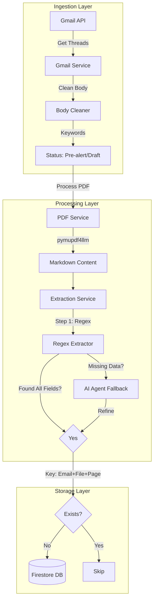
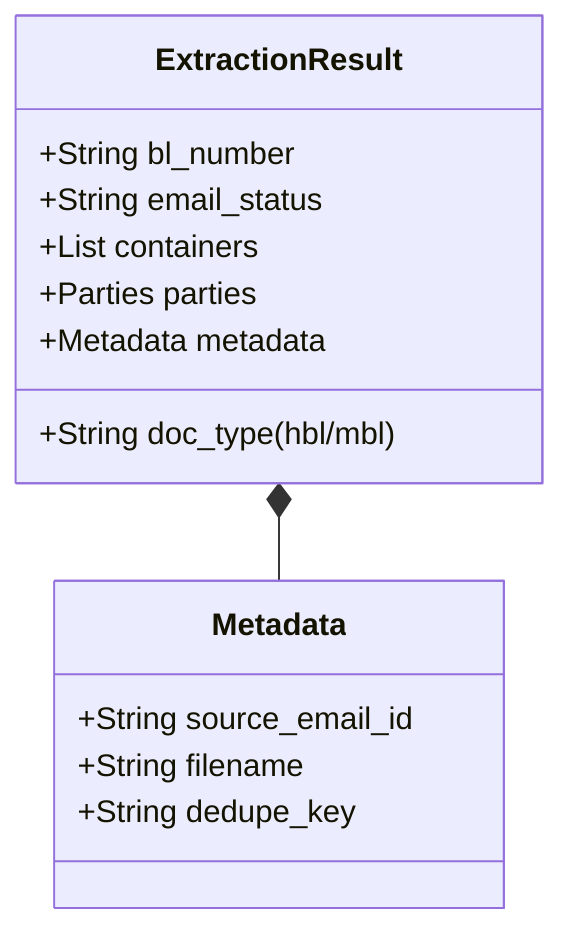

# LadingLens: Project Write-up

## My Approach & Implementation Journey

I started this project with a solid foundation in Google Cloud Platform (GCP) and the Gmail API, which I was already familiar with. My goal wasn't just to meet the requirements but to build a system I could be proud of — I admit, I'm a bit of a sucker for perfection. Even when things "worked," I found myself iterating to optimize performance and reliability.

### 1. Iterative Development: From Basic to Optimized
My first attempt at fetching emails was straightforward: list messages and fetch them one by one. I quickly realized this was inefficient (`1 + N` API calls) and prone to race conditions with email threads.
- **Optimization**: I switched to the **Gmail Threads API**, which allowed me to fetch the entire conversation context in fewer calls (`1 + limit/batch`).
- **Sorting Logic**: I also fixed a critical issue where the latest message wasn't guaranteed. I implemented explicit sorting by `internalDate` to ensure I was always processing the most recent interaction in a thread.

### 2. The PDF Extraction Breakthrough
I started with `pdfplumber` and heavy regex usage. To be honest, it was frustrating; the extraction accuracy for tabular data (container lists) was poor (~73% in my benchmarks) because it relied on brittle x/y coordinates.
- **The "Aha" Moment**: I discovered `pymupdf4llm`. It converts PDF layouts into structured **Markdown** (preserving tables and headers). This was a life-saver! It turned a complex layout problem into a text parsing problem, boosting accuracy to **91%**.

### 3. Robust Data Validation (Pydantic)
One of the key strengths of this implementation is the use of **Pydantic Schemas** for data cleaning and validation.
- **Auto-Cleaning**: I used custom `@field_validator` in my schemas to automatically clean up messy inputs.
  - Example: Converting strings like `"15,777.6 kgs"` or `"45.2 CBM"` directly into clean floats (`15777.6`, `45.2`) transparently.
- **AI Integration**: When using `pydantic-ai`, I pass these same strict schemas to the LLM. If the LLM generates invalid data (e.g. a string for a date), Pydantic catches it, and the Agent automatically retries with the validation error as feedback. This loop ensures that **only valid data** ever reaches the database.

### 3. Tech Stack Choices
- **Pydantic & AI Agents**: I absolutely love Pydantic. Moving from raw dictionaries to Pydantic models made the codebase robust. Combining it with `pydantic-ai` for the AI Agent was a joy — being able to force the LLM to return a structured object that validates against my schema saved me hours of parsing headaches.
- **FastAPI & Async**: I leveraged FastAPI's background tasks to ensure the UI remains responsive while the heavy lifting happens asynchronously.
- **Logging**: I'm a big fan of visibility. I added detailed logging throughout the application so I can see exactly what's happening in the terminal at every step.

### 4. Frontend Strategy: Why Vite?
I chose **Vite** (with React) over Next.js for this dashboard. Here is my reasoning:

| **Feature** | **Vite** | **Next.js** |
| --- | --- | --- |
| **Best For** | Single Page Apps (SPAs), internal tools, dashboards. | SEO-heavy sites, public-facing apps, server-side rendering (SSR). |
| **Startup Speed** | Near-instant cold starts using native ES modules. | Can be slower to initialize, especially with heavy SSR. |
| **Routing** | Manual (e.g., `react-router-dom`). | Built-in file-based routing. |
| **Complexity** | Lightweight and unopinionated; you pick your tools. | Opinionated and structured; more "magic" under the hood. |
| **Backend** | Typically requires a separate backend (like your FastAPI). | Can handle its own backend via API routes. |

**Verdict**: Since this is an internal operational tool where SEO doesn't matter and I already have a dedicated FastAPI backend, Vite's speed and simplicity were the perfect fit.

---

## Core Logic Breakdown

### 📧 Classifying Pre-alert vs Draft
I rely on the **latest email body** for classification, ensuring I don't get confused by previous messages in a thread.
- **Strategy**: I implemented a rigorous "Body Cleaner" that strips out `On ... wrote:`, `From:...`, and signatures.
- **Classification**: A comprehensive set of keywords scans this clean text.
  - `pre-alert`, `pré-alerte` → **Pre-alert**
  - `draft`, `b/l to confirm` → **Draft**
- **Trade-off**: This regex/heuristic approach is instant and surprisingly accurate compared to running an expensive LLM call on every email body.

### 📑 Classifying HBL vs MBL
Document classification happens during the extraction phase for each PDF page group.
- **Approach**: I check for explicit headers (`**HOUSE BILL OF LADING**`, `**MASTER BILL OF LADING**`) or Bill number prefixes (`HBL-`, `MBL-`).
- **Splitting**: By processing pages individually (or in groups), I can handle single PDFs containing multiple mixed documents (e.g., Pages 1-2 HBL, Page 3 MBL) and save them as separate Firestore records.

### 🤖 Extraction Approach & Trade-offs
I designed a **Hybrid Extraction Pipeline** to balance cost, speed, and accuracy:
1.  **Regex (Primary)**: Running deterministic patterns against the Markdown content.
    - *Pro*: < 1 second latency, $0 cost, 100% reproducible.
    - *Con*: Can miss non-standard layouts.
2.  **AI Fallback (Secondary)**: Triggered only if regex misses critical fields (like `bl_number`) or if the PDF appears scanned.
    - *Pro*: Highly resilient, handles edge cases.
    - *Con*: Slower (~10s) and costs tokens.
- **Trade-off**: This hybrid model gives me the speed of regex with the resilience of AI.

### 🛡️ Extraction Confidence
I calculate a deterministic **Confidence Score** for every extraction (default `1.0` for regex matches).
- **Penalty Logic**: The score is penalized if critical fields are missing (BL Number, Shipper, Consignee, Carrier, Containers).
- **Formula**: `confidence = 1.0 - (missing_critical_fields_count * 0.1)` (floored at 0.5).
- **Utility**: This allows the UI to highlight "low confidence" extractions for human review, rather than failing them outright.

### 🔄 Deduplication Strategy
To guarantee idempotency (safe to re-run), I generate a deterministic hash key:
`dedupe_key = hash(source_email_id + attachment_filename + page_number)`
- **Check-First**: I check Firestore for this key *before* starting any extraction. If it exists, I skip immediately.
- **Failed Tracking**: I also track "failed" attempts to prevent the system from endlessly retrying a broken file on every job run.

### ⏱️ Background Job Architecture
Because processing emails and extracting data can be time-consuming, I implemented an asynchronous **Background Job** system using FastAPI `BackgroundTasks`.
- **Job ID Tracking**: Every `/process` request immediately returns a unique `job_id`.
- **Status Endpoint**: The frontend polls `/jobs/{id}` to show real-time progress (emails connected, pages extracted, documents saved).
- **Resilience**: This decouples the long-running process from the HTTP request, preventing timeouts and providing a better user experience.

---

## Architecture Visuals

### Data Schema

---

## Performance & Benchmarks

### Layout Analysis: pdfplumber vs pymupdf4llm
| Tool | Speed | Accuracy | Verdict |
| :--- | :--- | :--- | :--- |
| `pdfplumber` | ~20s | 73% | Brittle on tables |
| `pymupdf4llm` | ~13s | **91%** | **Winner** (Markdown structure is superior) |

### AI Model Comparison
- **Qwen 2.5 (7b)**: Verified best quality. Handled schemas perfectly.
- **Llama 3.2 (3b)**: Poor accuracy (~16%). Frequent hallucinations.

---

## Future Improvements & AI Usage

### How I Used AI Tools
I didn't just throw everything at an LLM. I used AI **surgically**:
- **Generative AI**: Specifically for the `pydantic-ai` fallback agent to parse difficult unstructured text.
- **Coding Assistant**: I used AI to help generate the initial Firestore schema Pydantic models to ensure strict typing.

### What I'd Improve with More Time
1.  **OCR Integration**: Pipeline Tesseract for purely scanned image PDFs before markdown conversion.
2.  **Semantic Search**: Use vector embeddings on email bodies to find "conceptual duplicates" that bypass ID checks.
3.  **User Feedback Loop**: Allow users to correct fields in the UI, feeding data back to improve the regex patterns.
4.  **More Testing (Pytest)**: While I have manual benchmark scripts, I would add a comprehensive `pytest` suite for unit testing the regex patterns and integration testing the API endpoints to ensure no regression.
